# Ito-verse Shell

**By [davidxap](https://github.com/Davidxap)** · v0.2.0-beta · [licence](#licence)

**Ito-verse Shell** is a bar and Control Centre for [Omarchy](https://omarchy.org) (Arch Linux + Hyprland),
**inspired by Junji Ito and Silent Hill**: ink, bone and blood. It replaces Omarchy's system colours and its bar
with a bar of its own, drawn as fine engravings instead of flat vector icons, and gives you a Control Centre to change
nearly everything without touching a file.

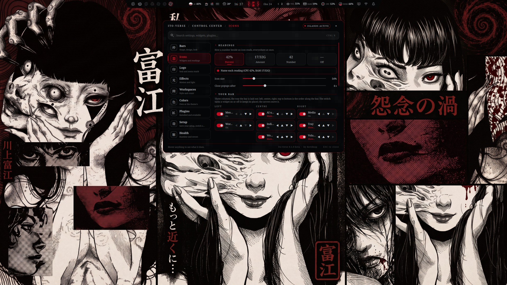

> **Status: beta.** This is the first version meant to be installed and used. It has been swept option by option
> and reviewed, but it is young: if anything looks wrong, open the Control Centre → **Health**, press
> **Copy report for an AI assistant** and paste it into any assistant, or read
> [docs/TROUBLESHOOTING.md](docs/TROUBLESHOOTING.md).

Fan work, not affiliated with or endorsed by Junji Ito, his publishers, Konami, HANCORE or Omarchy. See
[Credits](#credits-plainly) and [Licence](#licence).

## See it move

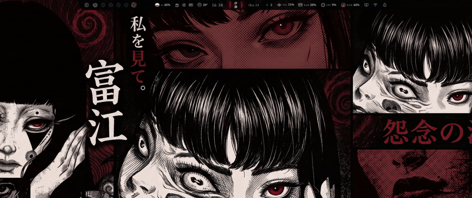

The full-quality video (1080p, 60 fps): [docs/media/tour.mp4](docs/media/tour.mp4).

> **About the theme you see.** The captures and the video were made with an early version of a colour theme called
> **Tomie**, based on *Tomie* by Junji Ito (the red-and-bone wallpaper is its only image here). It is a **work in progress**:
> what you see are first ideas, and the wallpaper is only there to give an impression. The finished theme will be released
> separately. Ito-verse works with any Omarchy theme. Link: *coming soon* (see [The Tomie theme](#the-tomie-theme)).

## What you get

- **A bar with real shapes.** Islands, full-width, fit, dock or notch; on any of the four edges; square, soft or
  round corners; three heights; three spacings; optional shadow and float.
- **A Control Centre you can read.** Click the 富江 seal (or bind a key). Nine pages, foldable sections, a search
  that opens everything it matches, and a footer that says what the thing under the pointer does.
- **Widgets that say what they measure.** `CPU 4%`, `RAM 17/32G`, `DISK 210/930G`, `VOL 51%`: as percent, as the
  real amount used out of the total, as a bare number, or off.
- **Your bar, in three columns.** Left, centre, right, each widget with a switch and arrows to move it. Popups
  that close themselves a few seconds after the pointer leaves them (you choose how long).
- **Eight workspace styles and your own.** Seals, Rings, Tomie's eyes, Remina, Uzumaki, Marks, Halo, Flauros, or
  four pictures of your own (empty, in use, active, urgent).
- **The seal and what stands beside it.** Five seals and thirteen decorations (veins, thorns, curls, hair, drips,
  eyes, cracks, stitches, holes, teeth, chain, static, fog), or your own pictures.
- **Media effects.** Blood, Spiral, Eye, Fog, Static, or your own picture or GIF behind the play buttons.
- **Popups drawn as manga panels.** Audio, network, Bluetooth, power, display, the calendar, the forecast, the media
  player, notification history and AI usage all open in an inked frame: a ruled double edge, torn corners, a spatter of
  blood, a burst of static as they open, and a small emblem at the head that says what they watch (sound waves, a web, a
  rune, a flame, a clock, a spiral, a telephone, a mind, the sky). One note at the foot, drawn each time from a few
  original lines. They open beside the bar on whichever edge it is on, and shrink to fit the screen.
- **Icons that answer.** Hover any icon on the bar and a halo of the accent rises behind it, with a gesture that fits what it is:
  the bell rings, the chip beats, the disk turns, the volume dances like a sound meter, the network beeps, and the weather plays
  what the sky is doing (rain falls, lightning strikes, heat rises, snow drifts, mist slides).
- **Motion that costs nothing at rest.** One setting (Off, Calm, Lively) governs every entrance; nothing animates while
  the shell is idle (about 0.5 % of one core).
- **A media player, a notification history, a forecast and a calendar.** Right-click the media rings or the bell; click the
  weather, the clock or the AI reading. Every popup also answers to `omarchy-shell` so a key can open it.
- **Nine motions for the marks** (spin, pulse, breathe, heartbeat, flicker, sway, glitch, ripple, or none) and a Light
  section for glow, vibrance, speed and strength.
- **Your look, saved.** Everything is remembered by itself; **Setup → My setups** keeps named copies you can load
  back in a click, all of it or only the look, or only the layout.
- **Other shells, one click away.** Omarchy's default bar, Shibumi, Caelestia and Ito-verse, switched from the
  Setup page. Installing Ito-verse keeps the shell you were on.
- **Any plugin can go on the bar.** The Plugins page lists every plugin the shell finds (ours, Omarchy's,
  Shibumi's, anyone's) and puts a widget on the bar with **Add**.
- **A Health page that fixes things and writes its own report.** Every check says what it means and how to fix it,
  most with a Fix button; the report is written so that any AI assistant can act on it.

## Popups and their emblems

Each popup carries a small drawn sign at its head, in the theme's colours, for what it watches:

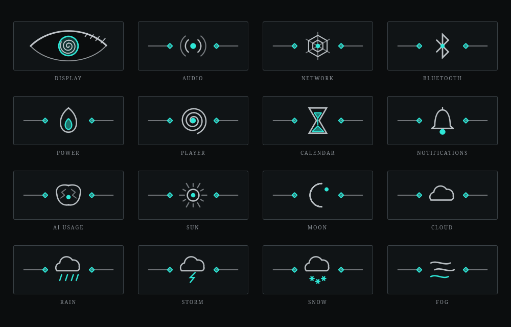

| | |
|---|---|
| 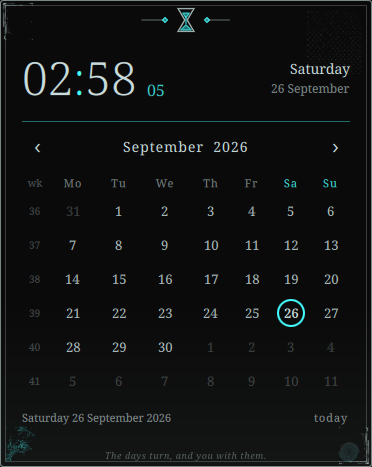 | 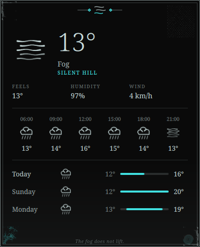 |

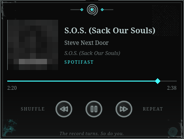

On a bar at the side of the screen the seal's decoration lies across the bar, above and below the seal, and the popups open
beside it:

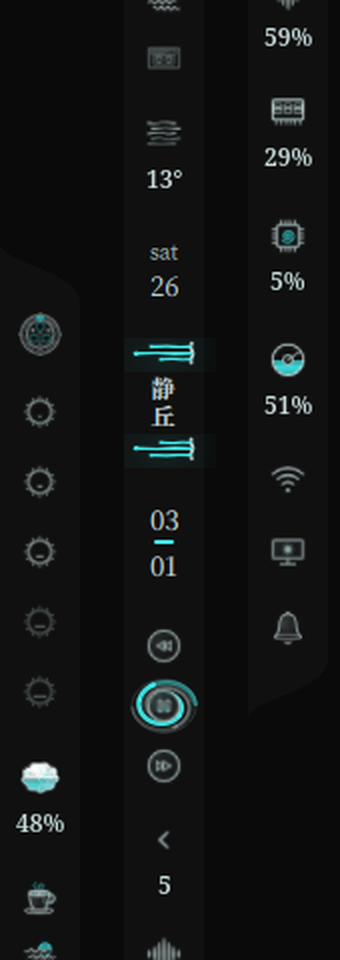

## Screenshots

Captured on the [Tomie theme](#the-tomie-theme), at native resolution.

| | |
|---|---|
|  |  |
|  |  |
|  |  |
|  |  |
|  | |

The bar itself, top edge, flush against the screen:

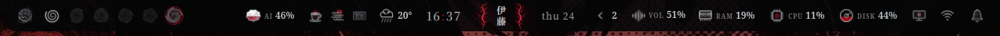

The menu, the workspaces (here drawn as watching eyes), the centre with the seal, the indicators, the tray and
media:

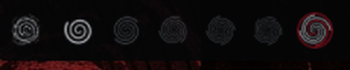

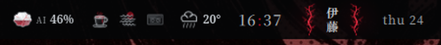

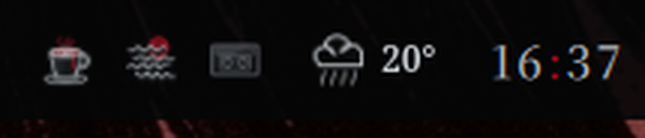

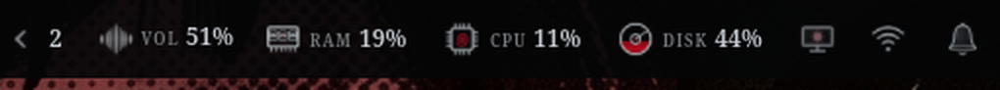

## The Tomie theme

Ito-verse is the shell; **Tomie** is the colour theme it is being drawn against, based on *Tomie* by Junji Ito. It is a
**work in progress** and is not published on its own yet. What is in this repository, and what you see in the captures, are
early ideas meant to give an impression of where it is going:

- **Palette and surfaces**: bone on ink with one live blood red, for the bar, popups, notifications, launcher, lock and the
  rest of Omarchy's shell (`themes/ito-verse/palette.toml`, `colors.toml`, `shell.toml`).
- **Wallpaper**: one Tomie collage, `themes/ito-verse/backgrounds/tomie.png`, the one used in the captures. It is the only
  wallpaper included; the rest of the set is not ready and is not published.
- **Cursor**: the Ito-verse cursor theme (an arrow with a dark backing so it reads on any page, and the Uzumaki spiral as
  the busy cursor): `python3 scripts/gen-cursors.py`.
- **Icons**: an inked icon theme for file managers, in the same hand as the bar's icons:
  `python3 scripts/gen-icons.py --install`.
- **GTK**: a stylesheet for GTK apps (`themes/ito-verse/gtk.css`).

When the theme is finished it will be published on its own, with everything above complete. The link goes here:

> **Tomie theme on the Omarchy Market:** *coming soon*

Until then, `omarchy theme set ito-verse` (Quick start, step 1) applies the early version that ships in this repository.
The bar does not depend on it: it follows whichever Omarchy theme is installed.

## Quick start

Requires Omarchy already installed and running Hyprland.

**From the Omarchy Marketplace** (once listed), or straight from GitHub:

```bash
omarchy plugin add https://github.com/Davidxap/ito-verse-shell
```

then enable the *Install Ito-verse Shell* widget, click it, and answer the questions in the terminal that opens: it says what
it will do and asks before it changes anything. Or do it by hand: download the repository from GitHub (the green **Code** button, then **Download ZIP**), unzip it and open a
terminal in the folder:

```bash
# 1. the colour theme (GTK, terminal, Hyprland borders...) via Omarchy's own switcher
cp -r themes/ito-verse ~/.config/omarchy/themes/ito-verse
omarchy theme set ito-verse

# 2. the bar: copy it onto your Omarchy config. Keeps the shell you are on as its own entry so you can go back
scripts/deploy.sh

# 3. make Ito-verse the active shell
scripts/shell-switch ito
```

Then click the seal in the middle of the bar, or run `omarchy-shell ito.controlcenter open`. Something not
right? `bar/modules/bin/ito-health --text` (or the Health page) says what and how to fix it.

To go back: **Setup → Shells → Switch** on the shell you came from, or `scripts/shell-switch omarchy`. To undo the
theme: `omarchy theme set <your previous theme>`.

Full instructions, updating and uninstalling: [docs/INSTALLATION.md](docs/INSTALLATION.md).

## Documentation

| | |
|---|---|
| [docs/USER_GUIDE.md](docs/USER_GUIDE.md) | Every page of the Control Centre, control by control |
| [docs/TUTORIALS.md](docs/TUTORIALS.md) | Step by step: make it yours, your own pictures and GIFs, move widgets, add a plugin, save a setup, switch shells, get help |
| [docs/CUSTOMIZATION.md](docs/CUSTOMIZATION.md) | Reference: settings, sizes that work, popups, readings, setups |
| [docs/INSTALLATION.md](docs/INSTALLATION.md) | Requirements, install, update, uninstall |
| [docs/FAQ.md](docs/FAQ.md) | Short answers to the questions people ask first |
| [docs/TROUBLESHOOTING.md](docs/TROUBLESHOOTING.md) | Every problem Health knows, what it means and the fix |
| [docs/COMPONENTS.md](docs/COMPONENTS.md), [docs/THEME_ARCHITECTURE.md](docs/THEME_ARCHITECTURE.md) | How it is built |
| [docs/ICON_SPEC.md](docs/ICON_SPEC.md) | Drawing icons of your own |
| [CONTRIBUTING.md](CONTRIBUTING.md), [CHANGELOG.md](CHANGELOG.md) | Working on it, and what changed |

## Compatibility

| | Status |
|---|---|
| **Arch Linux** | Supported. Developed and tested here. |
| **Omarchy** (with Hyprland) | Supported: Omarchy 4.0.4, Quickshell 0.3.x, Hyprland 0.56, Qt 6.11. The bar is a plugin of Omarchy's shell. |
| **Bar on any edge and any shape** | Supported and tested: top, bottom, left and right; Islands, Full, Fit, Dock and Notch. Popups follow the bar and fit the screen. |
| **Dark and light themes** | Supported (Follow theme mode). |
| **Ryoku** | **Not yet.** Ryoku is an independent desktop with its own shell and plugin format (bar styles in `barstyles/<id>/Scene.qml`, widgets through `Ryoku.PluginKit`), so this bar cannot run there as it is. Planned: an adapter that reuses the art, the palette logic and the popups. Nothing here claims it works today. |

## What it actually is

Ito-verse's bar (`ito.bar` / `ito.state`) runs **as a plugin hosted inside Omarchy's own shell engine**
(`qs.Ui`, `qs.Commons`): it is not a standalone Quickshell shell you could run outside Omarchy. `plugins/ito.bar`
is a fork of the Shibumi bar engine (see [Credits](#credits-plainly)) that adds a pluggable style system (islands,
splits, notch, corner radius per shape); `plugins/ito.*` are the widgets Ito-verse puts on it.

Most of the shell talks to the machine directly (Hyprland/sway/niri, PipeWire, UPower, Bluez, `brightnessctl`...)
through one small abstraction, `bar/modules/bin/ito-host`, so it is not tied to one distribution. Five widgets are
the exception: `ito.audio`, `ito.network`, `ito.bluetooth`, `ito.display` and `ito.power` are dressed versions of
Omarchy's own widgets and still call Omarchy's CLI tools (`omarchy-*`) for their panels. That is a deliberate,
known limitation: see [docs/THEME_ARCHITECTURE.md](docs/THEME_ARCHITECTURE.md).

## Everyday tools

Everything below lives in `bar/modules/bin/`, is installed once deployed, and is meant to be run directly:

| Tool | What it does |
|---|---|
| `ito-health` | Diagnoses the shell and its log, says why and how to fix each thing. `--fix all` applies every safe fix; `--report` writes the full report for an AI assistant; `--table` lists the known problems. |
| `ito-restart` | The one safe way to restart the shell (stops Omarchy's restart loop, waits, starts one, checks). Never `pkill quickshell`. |
| `ito-config` | Reads and writes the settings in `ito-style.json`. The Control Centre is a UI over the same file. |
| `ito-profile` | Saves the bar as you made it under a name, and loads it back: `list`, `save`, `load`, `delete`. |
| `ito-marks` | Adapts a picture of yours (mark, seal, decoration, workspace) to the shell's palette, and keeps your media effect. |
| `ito-host` | What the shell asks of the desktop (menu, workspace, terminal, night light, stay awake, do not disturb, recording), routed through what the machine has. |
| `ito-onebar` | Makes sure exactly one bar runs. |
| `ito-plugins`, `ito-shells`, `ito-design`, `ito-recover`, `ito-ai` | Listing, layout and recovery helpers used by the Control Centre. |

## Credits, plainly

The full list, with licences, is in [THIRD_PARTY_NOTICES.md](THIRD_PARTY_NOTICES.md). In short:

- **The bar engine is a fork.** `plugins/ito.bar` and `plugins/ito.state` come from
  [Shibumi-Shell](https://github.com/HANCORE-linux/Shibumi-Shell) by **HANCORE** (MIT). Measured against the
  original, about 91 % of the lines in `ito.bar` and 98 % in `ito.state` are still theirs: the layout engine, the
  drag-and-drop, the two layouts and the saved state. Ito-verse renamed it (`ito.*`), added its own visual style
  and made room for more widgets. Without that work this bar would not exist. Thank you, HANCORE.
- **Five widgets are Omarchy's own, re-skinned** (`ito.audio`, `network`, `bluetooth`, `power`, `display`): the
  logic is Omarchy's, by David Heinemeier Hansson and contributors (MIT); the artwork and readings are ours.
- **Written here, from scratch:** the other widgets, the Control Centre, workspace styles, seal and decorations,
  media effects, custom pictures and GIFs, saved setups, the Health page and its report, `ito-host` and the tools.
- **Inspired by** Junji Ito's manga (*Uzumaki*, *Tomie*, *Gyo*, *Amigara Fault*) and by the Silent Hill games.
  This is a fan work; it is not affiliated with or endorsed by their authors or publishers.
- **Some source images were found online and edited** (the art in `assets/native/cursor/` and `bar/modules/ito-art/` that was cut from a
  design sheet, which is not included here). They stay the
  property of their authors; see [ART_LICENSE.md](ART_LICENSE.md). Rights holders can ask for credit or removal.

## Licence

**Free to use, not to sell.** Ito-verse is source-available for non-commercial use: run it, change it, share it,
learn from it, build on it, but do not use it to make money.

| Part | Licence |
|---|---|
| The code | [PolyForm Noncommercial 1.0.0](LICENSE) |
| The bar engine (`plugins/ito.bar`, `ito.state`), a fork of Shibumi-Shell | MIT, © HANCORE ([details](plugins/ito.bar/LICENSE)) |
| Five widgets re-skinned from Omarchy's own (`ito.audio`, `network`, `bluetooth`, `power`, `display`) | MIT, © David Heinemeier Hansson (each folder's `LICENSE`) |
| The art (icons, marks, wallpapers) | Personal, non-commercial use ([ART_LICENSE.md](ART_LICENSE.md)) |

Because it forbids commercial use it is not "open source" in the OSI sense, which cannot; the source is open to
read, use and change. See [NOTICE](NOTICE) for the full list.
