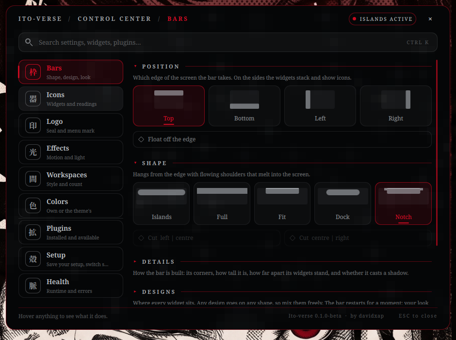
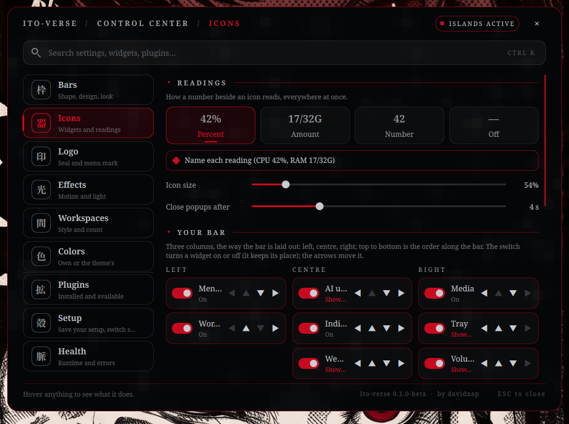
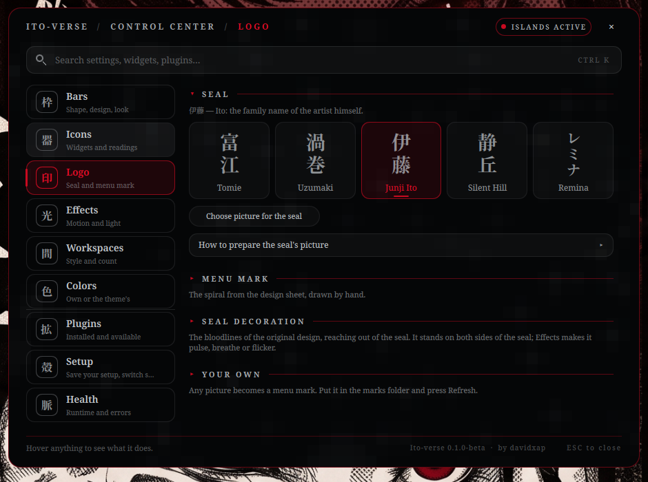
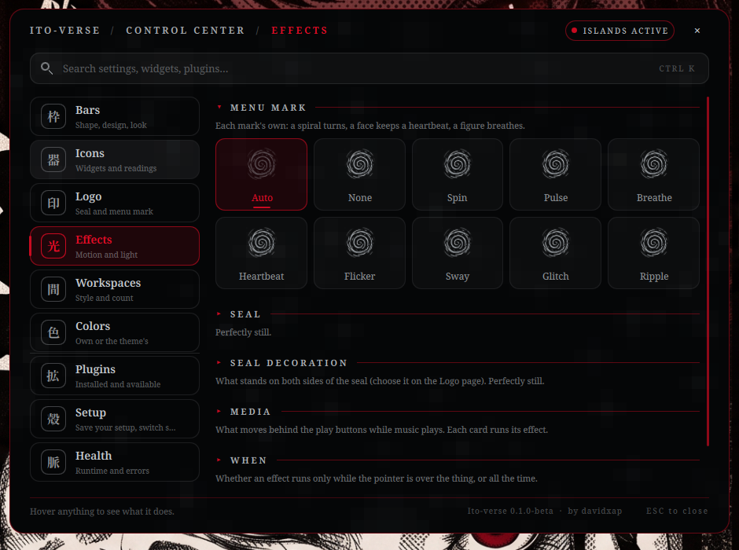
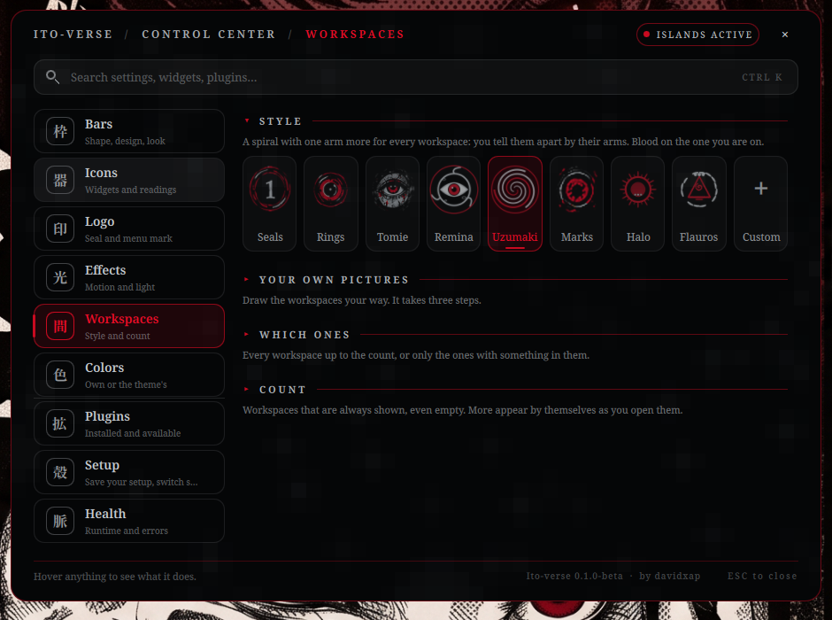
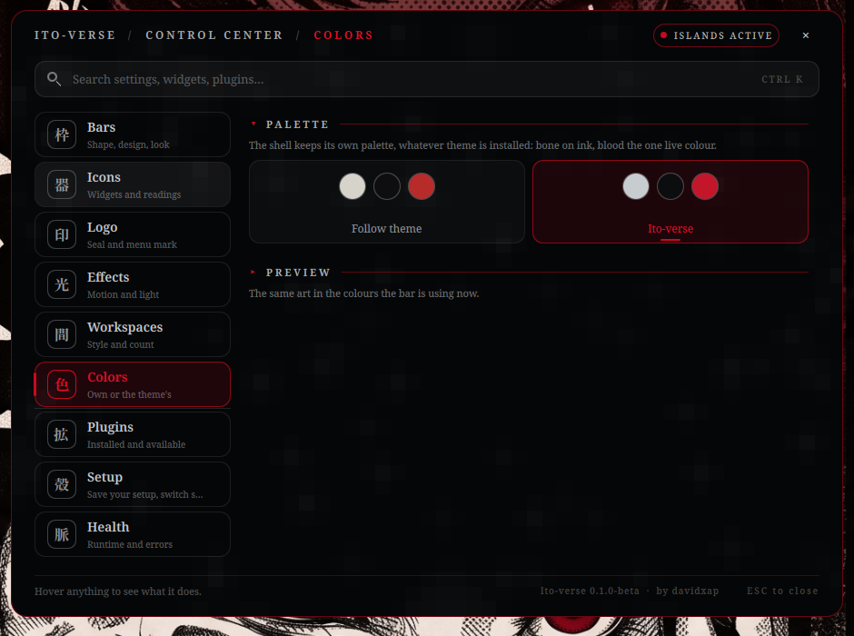
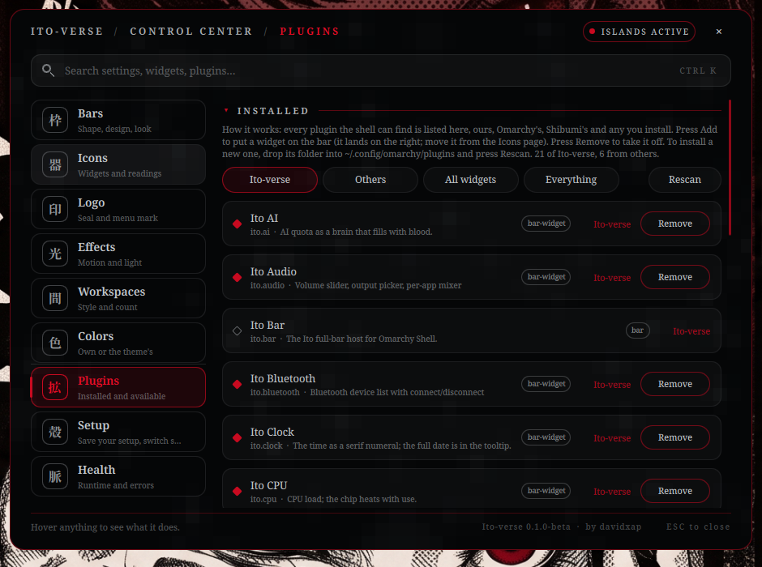
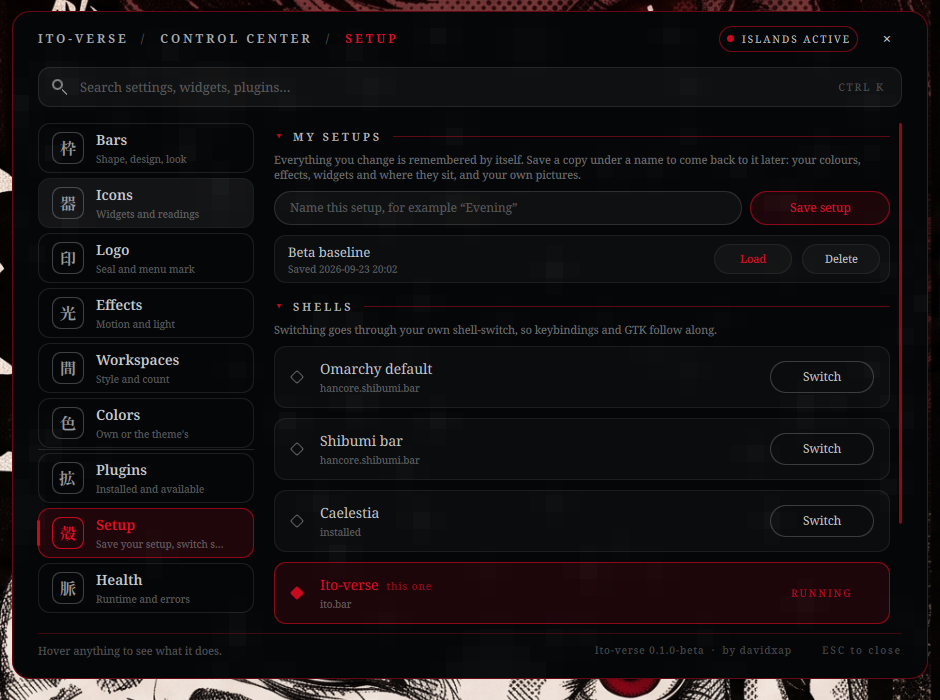
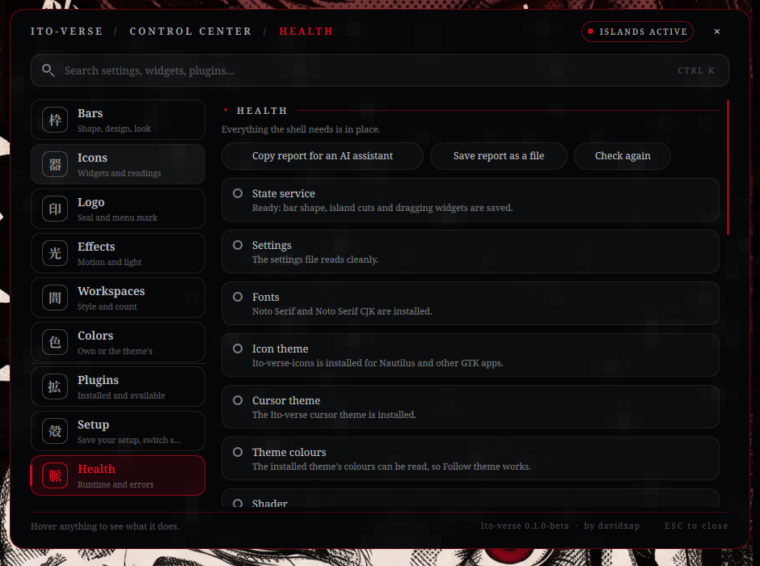

# User guide

Everything you can change lives in the **Control Centre**. This guide goes through it page by page. If you would
rather follow a task from start to finish, see [TUTORIALS.md](TUTORIALS.md).

## Opening it, moving around

- **Click the 富江 seal** in the middle of the bar.
- Or from a terminal or a keybinding: `omarchy-shell ito.controlcenter toggle` (also `open`, `close`, and
  `page <name>` to jump to a page: `bars`, `widgets`, `logo`, `effects`, `workspaces`, `colors`, `plugins`,
  `shells`, `health`). To bind a key, point one at `omarchy-shell ito.controlcenter toggle` in your Hyprland config.
- **Esc** closes it.

The window has three parts:

- **A sidebar** with the nine pages, in two groups: *Appearance* (Bars, Icons, Logo, Effects, Workspaces, Colors)
  and *System* (Plugins, Setup, Health).
- **A search box** (`Ctrl K`). Type a word and every section that matches opens by itself, on every page you visit.
- **A footer** that says what the thing under the pointer does, with the version and the author on the right.

### Foldable sections

Each page is split into sections with a small **▸** and a title. **Click a title to open or fold it.** The first
section of a page starts open; the rest start folded so a page never overwhelms you. Whatever you open stays open
while you stay on that page.

### Everything is saved by itself

Every switch, card and slider writes to your settings the moment you use it, and the bar follows at once. There is no
Apply and no Save to press. If you want a copy to come back to, see [Setup](#setup).

---

## Bars



The shape of the bar.

- **Position.** Top, bottom, left or right. On the sides the widgets stack and show icons only. *Float off the
  edge* lifts the bar clear of the screen edge as a pill; off (the default) it touches the edge with no gap.
- **Shape.** Islands, Full, Fit, Dock or Notch: how the bar is cut. Each card draws its shape.
- **Details.** *Corners* (square, soft, round), *Height* (slim 40, regular 46, tall 52), *Spacing* (tight, normal,
  airy), and *Shadow under the bar*.
- **Designs.** Where every widget sits: Classic, Cluster, Compact, Floating dock, Monitor, Minimal, Zen. Any design
  goes on any shape. The bar restarts for a moment when you apply one; your look stays as it is. *A design also sets
  its own shape* makes a design bring its own shape instead of using yours.
- **Look.** The plate the bar is painted on. Every layer is its own switch and they combine: grain, paper, blood,
  wood, glass, screentone, calm, torn edge, fog, borders, pills. Sliders for opacity, blood strength, grain and pill
  opacity.
- **Layout.** *Move widgets* enters an edit mode where you drag widgets on the bar itself: a line shows the gap it will go into,
  and only the widget you hold moves. *Reset look* puts the
  plate, effects, seal, workspaces and readings back to the defaults. *Reset layout* puts every widget back where it
  started. (For a gentler way to move widgets, use the Icons page.)

## Popups

The popups (audio, network, Bluetooth, power, display, the calendar, the forecast, the media player, the notification history
and the AI usage panel) share one look and one set of rules:

- **The frame.** An inked panel: a ruled double edge, torn corners, a spatter of blood and a screentone patch, a burst of
  static as it opens, an emblem at the head and a short note at the foot. Switch it off with **Bars → Details → Manga frame on
  popups**; the plain card comes back.
- **The emblem** says what the popup watches: sound waves (audio), a signal (network), a rune (Bluetooth), a flame (power),
  an eye (display), a spiral (media player), a clock (calendar), a telephone (notifications), a mind (AI usage), and the
  sky for the forecast (sun, moon, cloud, rain, storm, snow, fog). Move the pointer near the head and it brightens.
- **Where they open.** Beside the bar, on whichever edge it is on, and they shrink to fit a small screen.
- **Motion.** They follow **Effects → Motion** (off, calm, lively).

| Popup | Open it | From a key |
|---|---|---|
| Audio | Click the volume reading | `omarchy-shell omarchy.audio toggle` |
| Network | Click the network icon | `omarchy-shell omarchy.network toggle` |
| Bluetooth | Click the Bluetooth icon | `omarchy-shell omarchy.bluetooth toggle` |
| Media player | Right-click the media rings | `omarchy-shell ito.player toggle` |
| Calendar | Click the clock or the date | `omarchy-shell ito.calendar toggle` |
| Forecast | Click the weather | `omarchy-shell ito.weather toggle` |
| Notification history | Right-click the bell (a click toggles Do Not Disturb) | `omarchy-shell ito.notifycenter toggle` |
| AI usage | Click the AI reading | `omarchy-shell ito.aiusage toggle` |

Every one also answers to `open` and `close`. The media player shows the cover, the title, a progress line you can click to
seek, shuffle and repeat when the player supports them, and the controls. The notification history lists the last ten
notifications Omarchy kept, with the Do Not Disturb switch and a way to clear them.

## Icons



Which widgets are on the bar, where, and how they read.

- **Readings.** How every number reads, everywhere at once:
  - **Percent**: `RAM 42%`.
  - **Amount**: the real quantity where there is one, used out of the total: `RAM 17/32G`, `DISK 210/930G`. Loudness,
    load and the rest have no total and stay a percentage. The total is detected from the machine, not fixed.
  - **Number**: the bare number, no unit.
  - **Off**: icons only.
  - **Name each reading** puts a small label in front (`CPU 42%`, `VOL 51%`), as Shibumi does. Horizontal bars only.
  - **Icon size** is the one size every icon shares, as a share of the bar's height.
  - **Close popups after** is how many seconds a widget's popup (calendar, volume, network, weather, AI usage...)
    stays once the pointer leaves it. `Never` (0) keeps it open until you click again. The pointer being on the popup
    keeps it open.
- **Your bar.** Three columns, laid out the way the bar is: **left, centre, right**; top to bottom is the order along
  the bar. Each widget has:
  - a **switch** that turns it on or off (it keeps its place),
  - **◀ ▶** to send it to the neighbouring column and **▲ ▼** to move it one place along its column,
  - for widgets with a reading, a **"Shows: Icon + text ↻"** line: click it to cycle icon and number, icon only,
    number only.
  **Drag a widget by its grip (⋮⋮) to any place in any column**; a line shows where it will land. The arrows do the same in small steps.
  The seal has a dot instead of a switch: it always stays on so the Control Centre can always be reached.
- **Not on the bar.** Widgets that are in no column: click one to add it (it lands on the right; move it from there).
- **Network icon.** Auto (the port on a cable, the signal arcs on Wi-Fi), always arcs, always the port.
- **Indicator icons.** Stay awake (Coffee, Radio, Flashlight), night light (Moon, Fog), recording (Eye, Tape): each
  in several drawings, some from Silent Hill.
- **AI usage icon.** What the AI quota fills as it is spent: Brain, Hemispheres, Neurons, Eye or Spiral.

## Logo



The seal in the middle of the bar, what stands beside it, and the menu button.

- **Seal.** The kanji: Tomie (富江), Uzumaki (渦巻), Junji Ito (伊藤), Silent Hill (静丘), Remina (レミナ), or
  **your own picture** (*Choose picture for the seal*).
- **Menu mark.** The application-menu button: Uzumaki, Tomie, Remina, Amigara, Metatron (two versions), Halo, Flauros
  or the sheet spiral, or **your own picture** (*Choose picture for the menu mark*).
- **Seal decoration.** What stands on both sides of the seal: veins, thorns, curls, hair, drips, eyes, cracks, stitches,
  holes, teeth, chain, static, fog, or none; or **your own picture** (*Choose picture for the decoration*).
- **Your own.** Marks you have added; click one to use it.

Each *Choose picture* button opens your file dialog. A folded **How to prepare** panel under it gives the exact size
and format. A file that is too heavy or not a picture is refused with a sentence that says why. See
[CUSTOMIZATION.md](CUSTOMIZATION.md#your-own-pictures-and-effects) for the sizes.

## Effects



How the shell moves and how much light it gives off. The cards run their effect live.

- **Menu mark / Seal / Seal decoration.** One of: Auto (each mark's own), None, Spin, Pulse, Breathe, Heartbeat, Flicker,
  Sway, Glitch, Ripple.
- **Media.** What moves behind the play buttons while something plays: Blood, Spiral, Eye, Fog, Static, or **Your own**
  (a picture or GIF). It only draws while something is playing, so an idle bar costs nothing.
- **Motion.** How things appear: *Off* (instant), *Calm* (default) or *Lively*. Popups, labels, the Control Centre and
  the workspace marks follow it.
- **When.** Effects run only while the pointer is over the thing (*On hover*, free while idle) or all the time
  (*Always*).
- **Light.** *Glow* (the bloom behind marks and active items; 0 turns every glow off), *Colour vibrance* (a quieter or
  more saturated accent), *Effect speed* and *Effect strength*. *Reset effects* puts them back.

## Workspaces



- **Style.** Seals (numbered rings), Rings, Tomie (eyes and lips), Remina (the planet with one eye), Uzumaki (a spiral
  with one arm more for each workspace), Marks, Halo, Flauros, or **Custom**.
- **Your own pictures.** Four boxes, one for each state a workspace can be in: *Empty*, *In use*, *Active*, *Urgent*.
  Click a box, choose a file, done. One picture is enough: the empty boxes borrow from it. A row under the boxes shows
  how they look on the bar, and *Remove my pictures* goes back to Rings.
- **Which ones.** *Always N* draws the first N workspaces so the row never changes width; *Only in use* draws only those
  with windows, and the one you are on.
- **Count.** How many are always shown (1 to 10).

## Colors



- **Palette.** *Follow theme* takes the colours of the installed Omarchy theme and changes with it (the default);
  *Ito-verse* is the shell's own palette (bone on ink, blood the one live colour) and does not change with the theme.
- **Accent.** In *Follow theme* mode, which colour of the theme is the blood: the theme's accent, Ito blood, or any of
  its palette colours, or a colour you type.
- **Preview.** The same art in the colours the bar is using now.

## Plugins



Every plugin the shell can find, wherever it came from: Ito-verse, Omarchy, Shibumi, or anyone's. Filter with
*Ito-verse*, *Others*, *All widgets*, *Everything*.

- **Add** puts a widget on the right side of the bar; **Remove** takes it off. The bar restarts for a moment.
- To install a new plugin, drop its folder (a `manifest.json` and a `BarWidget.qml`) into
  `~/.config/omarchy/plugins/` (or `~/.config/ito/plugins/`) and press **Rescan**.
- After adding, move it wherever you like from the Icons page.

## Setup



- **My setups.** Everything you change is remembered by itself. Type a name and press **Save setup** to keep a named
  copy: your colours, effects, widgets and where they sit, and your own pictures. **Load** puts the bar back the way the
  setup was (it restarts for a few seconds). **Look** brings back only the colours, effects, marks and pictures and leaves the
  bar's shape and widgets alone; **Layout** brings back only the edge, shape and widgets and leaves the look. **Delete**
  removes the copy, not the bar.
- **Shells.** Every shell it finds: Omarchy's default bar, Shibumi, Caelestia, Ito-verse. **Switch** stops this shell and
  starts that one. Installing Ito-verse keeps the shell you were on as its own entry, so going back is one click.
- **About.** Who made it, where, and the licences.

## Health



What is wrong with the shell, why, and how to put it right.

- Each check says what it found. One that is not well also says **what it means** and **what to do**, and most have a
  **Fix** button.
- **Fix everything** applies every fix that is offered, restarting the shell once at the end if it needs it.
- **Copy report for an AI assistant** copies a full report (what is wrong, your machine and setup, the log, and how to
  fix each thing) so you can paste it into any assistant and it can solve the problem. **Save report as a file** writes
  the same report to `~/ito-health-report.md`.
- **Check again** runs every check again.

The report contains your Ito-verse settings, the list of plugins, monitor names and recent log lines. It has no
passwords or tokens, but read it before you paste it somewhere public.

---

## From the terminal

The panel is a front for a few tools in `bar/modules/bin/`: see the README's table. The most useful:

```bash
ito-health --text          # the diagnosis, in plain text
ito-health --fix all       # apply every safe fix
ito-health --report        # the full report for an AI assistant
ito-config list            # every setting
ito-config set valueStyle amount
ito-profile save "Evening" # a named setup
ito-profile load "Evening"
ito-restart                # the one safe way to restart the shell
```
